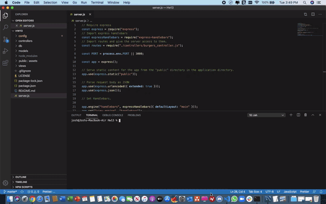

# Eat-Da-Burger


A burger logger webpage app is created here with MySQL, Node, Express, Handlebars and ORM. It allows users to submit the names of burgers they'd like to eat. Whenever a user submits a burger's name, the burger will be displayed on the left side of the page with a `Devour it!` button. When the user clicks the `Devour it!` button, the burger will move to the right side of the page. The burgers also gets stored in the database. This app is deployed in heroku and is also added to my portfolio (links provided below).


## Installation
```
npm install
```

## Usage
```
npm start
```

## License
This project is licensed under MIT 

[](https://opensource.org/licenses/MIT)


## Deployed URL Link
https://whispering-everglades-09702.herokuapp.com/


## Updated Portfolio Link
https://joshb4u.github.io/portfolio.html


## Video Link
https://joshb4u.github.io/Hw13/public/assets/demo.mp4


## Preview (GIF)
